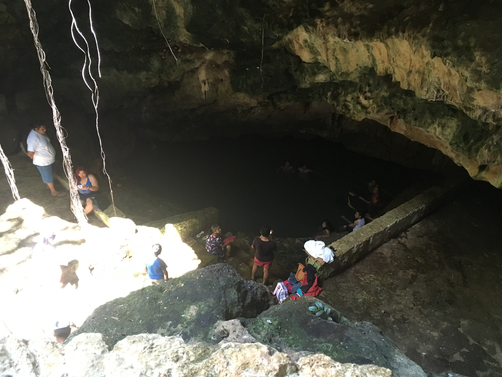

## 10 de julio
Home

## 7 de julio
Palenque

## 6 de julio
head

## 30 de junio
Chichen Itza

## 18 de junio
governor's palace
merida museum

## 15 de junio
Otros arqueólogos fueron buceo en un cenote y regresaron con esqueletos y cráneos de animales que cayeron ¿Y algún personas que cayeron o fueron sacrificados?

  

  

## 11 de junio
Por un descanso, fuimos a Celestún en la oeste costa de la península. Hay un mangle hermoso ahí y los vimos en una vuelta barco.

  

  

## 10 de junio
En Telchaquillo, las casas no están cerrados a naturaleza. Vi una tarántula muerta y muchos gecos y palomillas. 

  

  
  

## 1 de junio
Las personas de la región conocen la tierra bien. llevaron nosotros mientras trazamos un antiguo camino.

  

## 28 de mayo
Tecoh son un pueblo más grande que Telchaquillo pero más pequeño que Merida. Tiene una pirámide en su plaza.

  

  

## 22 de mayo
Hoy fue mi primera dia trabajando en algún ruinas en la selva. Ruinas son en todas partes debajo tierra y plantas.

  

  

## 21 de mayo
Una ciudad como Mérida tengo muchos plazas. Muchas personas pasan la tarde y la noche en plazas.

  
  

  

## 15 de mayo
hammock 
Como cada ciudad en Mexico, Telchaquillo tengo un zócalo. En su zocala, hay una iglesia, una cancha, y una cenote. 

  
  <figcaption>El zócalo</figcaption>

  
  <figcaption>Cenote</figcaption>

## 14 de mayo
Hoy es mi cumpleaños! También, mi padre y yo llegamos en Telchaquillo antes 4 días en el carro. Telchaquillo es un pueblo pequeño en la Yucatan Peninsula. El pueblo es en un área pobre aproximadamente uno hora sur del centro de la peninsula, Merida.

  
  <figcaption>Afuera el laboratorio y mi nueva casa</figcaption>

  
  <figcaption>Mapa de Mexico</figcaption>

