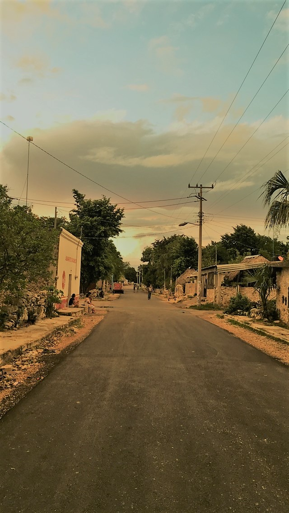
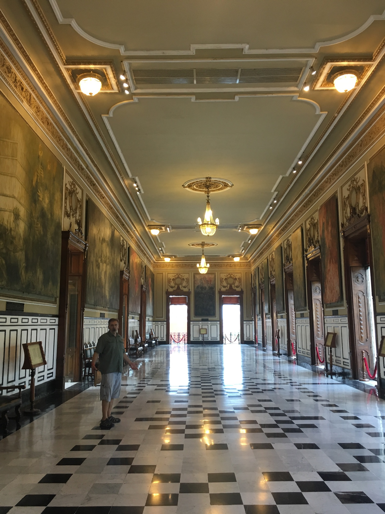
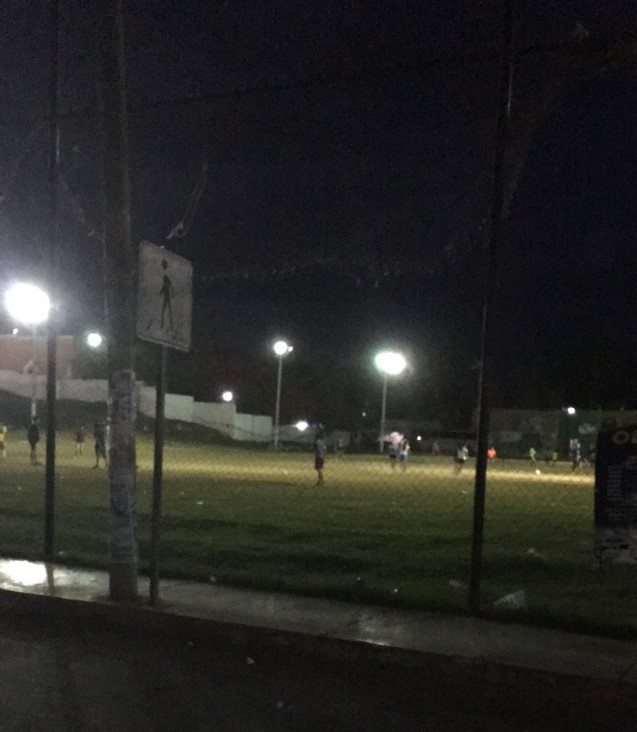

<iframe src="https://calendar.google.com/calendar/b/2/embed?height=600&amp;wkst=1&amp;bgcolor=%23ffffff&amp;ctz=America%2FNew_York&amp;src=YWNtd3VreUBnbWFpbC5jb20&amp;src=YWRkcmVzc2Jvb2sjY29udGFjdHNAZ3JvdXAudi5jYWxlbmRhci5nb29nbGUuY29t&amp;src=ZzZuZXNlYWpyZ3FnbHRnYnRhZTcxb2Y4amtAZ3JvdXAuY2FsZW5kYXIuZ29vZ2xlLmNvbQ&amp;src=ZW4udXNhI2hvbGlkYXlAZ3JvdXAudi5jYWxlbmRhci5nb29nbGUuY29t&amp;color=%23039BE5&amp;color=%2333B679&amp;color=%23F4511E&amp;color=%230B8043" style="border:solid 1px #777" width="800" height="600" frameborder="0" scrolling="no"></iframe>

# ¡Bienvenidos!
En 2018, fui a México ayudar mi padre, un arqueólogo. Vivimos en Telchaquillo por casi dos meses. Lea el blog a aprender sobre mi verano.

  

  
 

 
  
## 7 de julio
  Mi familia salieron por avión pero mi padre y yo debimos conducir. En el camino fuimos Palenque y La Venta.
  

  

    
  

  

  

  

    
  

  

  
## 30 de junio
  Mi familia vinieron y fuimos a Chichen Itza.
  

  

    
  

  

  

  

    
  

  

  

  

    
  

  

  

  

    
  

  

## 18 de junio
  En Mérida, el palacio de gobernador es ahora un museo. Tiene mucho arte y historia del región.
  

  

    
  

  

  

  

    
  

  

  
## 15 de junio
  Otros arqueólogos fueron buceo en un cenote y regresaron con esqueletos y cráneos de animales que cayeron ¿Y algún personas que cayeron o fueron sacrificados?
  

  

    
  

  

  

  

    
  

  

## 11 de junio
  Por un descanso, fuimos a Celestún en la oeste costa de la península. Hay un mangle hermoso ahí y los vimos en una vuelta barco.
  

  

    
  

  

  

  

    
  

  

## 10 de junio
  En Telchaquillo, las casas no están cerrados a naturaleza. Vi una tarántula muerta y muchos gecos y palomillas. 
  

  

    
  

  

  

  

    
    
  

  

  
## 1 de junio
  Las personas de la región conocen la tierra bien. llevaron nosotros mientras trazamos un antiguo camino.
  

  

    
  

  

## 28 de mayo
Tecoh son un pueblo más grande que Telchaquillo pero más pequeño que Merida. Tiene una pirámide en su plaza.

  

  

## 24 de mayo
Mayapán es un sitios arqueológicos menos que diez minutos de Telchaquillo. Mi padre trabajó ahí hace muchos años. Ahora, trabaja en ruinas oculto debajo la selva.

  

  

## 22 de mayo
Hoy fue mi primera dia trabajando en algún ruinas en la selva. Ruinas son en todas partes debajo tierra y plantas.

  

  

## 21 de mayo
Una ciudad como Mérida tengo muchos plazas. Muchas personas pasan la tarde y la noche en plazas.

  
  

  

## 15 de mayo
Como cada ciudad en México, Telchaquillo tiene un zócalo. En su zocala, hay una iglesia, una cancha, y una cenote.

  
  <figcaption>El zócalo</figcaption>

  
  <figcaption>Cenote</figcaption>

## 14 de mayo
Hoy es mi cumpleaños! También, mi padre y yo llegamos en Telchaquillo antes 4 días en el carro. Telchaquillo es un pueblo pequeño en la Yucatan Peninsula. El pueblo es en un área pobre aproximadamente uno hora sur del centro de la peninsula, Mérida.

  
  <figcaption>Afuera el laboratorio y mi nueva casa</figcaption>

  
  <figcaption>Mapa de Mexico</figcaption>

